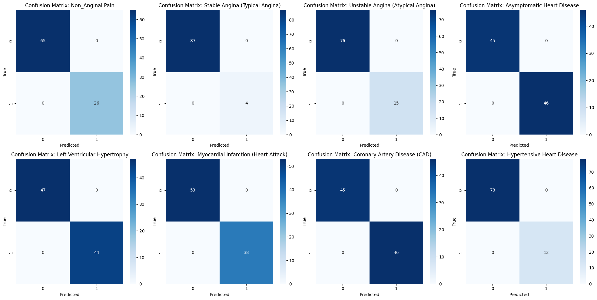

# Cardiovascular Diseases Prediction


## Table of Contents
- [Project Overview](#project-overview)
- [Installation](#installation)
- [Usage](#usage)
- [Model Details](#model-details)
- [Application Features](#application-features)
- [Results](#results)
- [Contributing](#contributing)
- [License](#license)

## Project Overview
This project aims to predict the risk of various cardiovascular diseases using machine learning. It includes:

- A comprehensive machine learning pipeline for disease prediction
- A Streamlit web application for risk assessment
- Multiple trained models for different cardiovascular conditions
- Detailed visualizations and analysis of model performance

The dataset used is from the UCI Machine Learning Repository: [Heart Disease Dataset](https://archive.ics.uci.edu/dataset/45/heart+disease)

## Installation

1. Clone the repository:
```bash
git clone https://github.com/kushagra-a-singh/Cardiovascular-Diseases-Prediction.git
cd Cardiovascular-Diseases-Prediction
```

2. Install dependencies:
```bash
pip install -r requirements.txt
```

## Usage

To run the Streamlit application:
```bash
streamlit run app.py
```

The application will be available at `http://localhost:8501`

## Model Details

The project implements multiple machine learning models to predict various cardiovascular diseases:

### Models Implemented
- Logistic Regression
- Support Vector Machine (SVM)
- K-Nearest Neighbors (KNN)
- Random Forest
- XGBoost
- LightGBM
- CatBoost
- Naive Bayes

### Multi-Output Model
A custom multi-output Random Forest model is implemented to predict multiple disease types simultaneously.

### Confusion Matrix for Diseases


### SHAP Plot


### Key Features
- Feature engineering with polynomial features
- Comprehensive model evaluation metrics
- SHAP values for feature importance analysis
- Learning curve analysis
- ROC curve comparison

## Application Features

The Streamlit application provides:

1. **Risk Assessment**
   - Input patient information and clinical data
   - Get risk predictions for 8 cardiovascular diseases
   - View confidence intervals and risk levels

2. **Detailed Analysis**
   - Feature importance visualization
   - Disease-specific information and recommendations
   - Emergency warning system for critical conditions

3. **Educational Resources**
   - Information about cardiovascular diseases
   - Prevention and management strategies
   - Links to health resources

## Results

### Model Performance


### Learning Curves


### ROC Curve Comparison of Models


### Feature Correlation with Disease Types


### Custom Stacking Model Confusion Matrix


## Contributing

Contributions are welcome! Please follow these steps:

1. Fork the repository
2. Create a new branch
3. Commit your changes
4. Push to the branch
5. Open a pull request

## License

This project is licensed under the MIT License - see the [LICENSE](LICENSE.txt) file for details.

## Acknowledgments
- UCI Machine Learning Repository for the dataset
- Streamlit for the web application framework
- Scikit-learn, XGBoost, LightGBM and CatBoost for machine learning implementations
